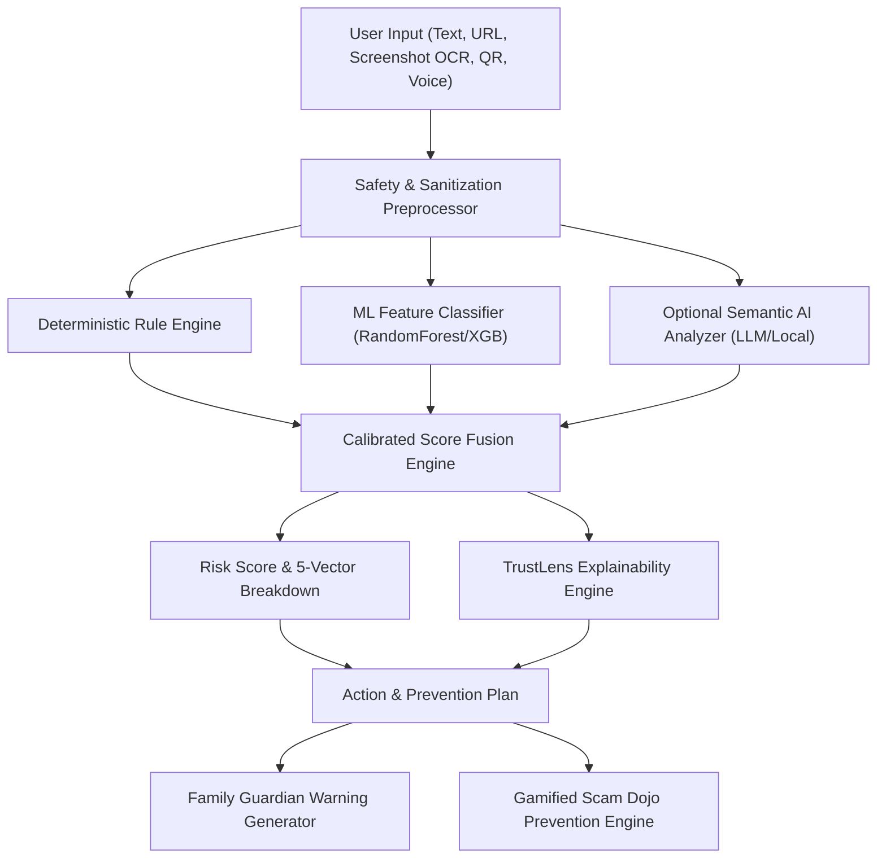

# ScamShield AI — Architecture Documentation

ScamShield AI is engineered around a multi-signal, transparent cybersecurity detection and explainability pipeline. Rather than treating threat intelligence as a black box or simple LLM wrapper, ScamShield executes independent heuristic rules, lexical URL feature extractors, lightweight machine learning models, and optional semantic AI analyzers in parallel, synthesizing them via a calibrated score fusion engine.

## System Architecture Diagram

---

## Core Modules & Responsibilities

### 1. Safety & Sanitization (`backend/safety/sanitization.py`)
- **Strict Input Length Limits**: Enforces 10,000 char limits to guard against buffer overruns and ReDoS attacks.
- **Credential Redaction**: Detects and masks 16-digit card patterns, passwords, and 6-digit OTPs before processing.
- **Safe Extraction**: Extracts URLs via regex and parses syntax using `urllib.parse` without making external network calls.
- **Zero SSRF Policy**: ScamShield never fetches suspicious links from the server.

### 2. URL Feature Extraction Engine (`backend/detection/url_features.py`)
Extracts 20+ lexical, structural, and brand-consistency features:
- **Lexical**: URL length, domain length, path length, dot count, hyphen count, digit count.
- **Host Analysis**: IPv4 / hex host detection, Punycode IDN homograph detection (`xn--`), high-risk TLD checks (`.xyz`, `.top`, `.loan`, `.buzz`, etc.).
- **Shannon Entropy**: Measures character randomness across domain and path segments to catch Domain Generation Algorithms (DGA).
- **Brand Mismatch Detection**: Correlates brand tokens (`sbi`, `hdfc`, `paypal`, `amazon`, `indiapost`) against verified official domain whitelists to catch brand spoofing.

### 3. Transparent Rule Engine (`backend/detection/rules.py`)
Executes deterministic heuristic rules returning structured, explainable evidence objects:
- `detect_urgency()`: Detects artificial deadlines and rushed demands.
- `detect_threat()`: Detects account suspension and intimidation ("digital arrest").
- `detect_credential_request()`: Detects fake KYC forms and password inputs.
- `detect_otp_request()`: Detects 2FA OTP solicitation.
- `detect_financial_request()`: Detects advance-fee and gift card demands.
- `detect_impersonation()`: Flags unauthorized claims of representing banks or agencies.
- `detect_delivery_scam()`: Flags ₹25 package rescheduling lures.
- `detect_job_scam()`: Flags YouTube like/review high-yield task schemes.

### 4. Machine Learning Classifier (`backend/detection/classifier.py`)
- Transforms text and URL inputs into a unified 26-dimensional numerical vector.
- Fits a `RandomForestClassifier` pipeline (`models/scam_url_model.joblib`).
- Employs calibrated feature statistical inference as an instant fallback if model weights are loading.

### 5. Multi-Signal Fusion Engine (`backend/detection/fusion.py`)
- Fuses rule score, URL score, ML score, and optional semantic score into a single normalized score between `0.00` and `1.00`.
- Configurable thresholds:
  - `0.00 - 0.34`: **SAFE**
  - `0.35 - 0.69`: **SUSPICIOUS**
  - `0.70 - 1.00`: **HIGH RISK**
- Computes 5-factor radar breakdown: Domain, Social Engineering, URL Pattern, Message Intent, Credential Request.

### 6. TrustLens Evidence & Red-Flag Engine (`backend/detection/evidence.py`)
- Translates raw detection signals into numbered, human-first evidence cards (`01 — URGENCY`, `02 — IMPERSONATION`, `03 — DOMAIN MISMATCH`, etc.).
- Identifies exact substring positions in the user's message for interactive inline highlighting.
- Generates tailored action plans with official Indian cybercrime reporting resources (`https://cybercrime.gov.in` and national helpline `1930`).

### 7. Vision & Voice Processing (`backend/vision/`, `backend/voice/`)
- **RapidOCR**: Runs offline, ONNX-accelerated optical character recognition on screenshots to extract text without external cloud API dependencies.
- **OpenCV QRCodeDetector**: Decodes QR code matrices safely into URL, UPI, or text payloads.
- **Speech Ingestion**: Accepts audio notes (.wav, .mp3) with transcript fallback.

### 8. Gamified Scam Dojo (`backend/api/dojo.py`, `frontend/components/ScamDojo.tsx`)
- Multi-level training module covering 6 distinct scam tiers (Obvious scams, subtle phishing, fake customer support, job scams, UPI scams, advanced social engineering).
- Instant verification, streak tracking, score multiplier, and cybersecurity skill rank progression.
